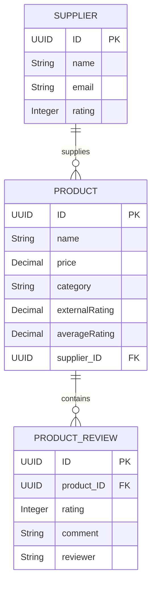

Supplier Product Management API (SAP CAP & TypeScript)

A fully functional, enterprise-grade Supplier Product Management API built with the SAP Cloud Application Programming Model (SAP CAP), Node.js, and TypeScript.

The service manages Suppliers, Products, and Product Reviews, with automated external data enrichment from a public API ([FakeStoreAPI](https://fakestoreapi.com/products)), robust input validations, and a custom action to submit reviews and recalculate average ratings in real time.

Note: I tried to deploy on the trial SAP cloud but it failed due to not being able to confirm the phone number for the trial account which is a requirement for SAP BTP.
---

Table of Contents

1. Architecture & System Design
2. Features & Requirements Coverage
3. Design Decisions & Trade-Offs
4. Assumptions Made
5. Prerequisites & Installation
6. Running the Application
7. Running Automated Tests
8. Sample API Requests
9. Bonus Implementations

---

Architecture & System Design

The application follows SAP CAP best practices with clean separation of concerns:

```
├── db/                                # Domain Data Layer
│   ├── schema.cds                     # CDS schema defining entities, types & associations
│   └── data/                          # CSV seed data for initial local development
│       ├── sap.supplier.product-Supplier.csv
│       ├── sap.supplier.product-Product.csv
│       └── sap.supplier.product-ProductReview.csv
├── srv/                               # Service & Application Logic Layer
│   ├── catalog-service.cds            # CatalogService definition & submitReview action signature
│   ├── catalog-service-ui.cds         # SAP Fiori Elements UI annotations
│   ├── catalog-service.ts             # Service handlers, validations & business logic
│   └── external/
│       └── fakestore-client.ts        # External FakeStoreAPI client with retry & timeout resilience
├── test/                              # Automated Testing Suite
│   └── catalog-service.test.ts        # Unit & integration tests for service logic
├── .cdsrc.json                        # CAP environment configuration
├── requests.http                      # Ready-to-run REST Client HTTP requests
├── package.json                       # Project metadata, dependencies and scripts
└── tsconfig.json                      # TypeScript configuration
```

Domain Data Model (CDS)

- `Supplier`: Holds supplier metadata, email, and rating ($1-5$). Has a `to-many` association to `Product`.
- `Product`: Holds product details (name, price, category), an `externalRating` (enriched asynchronously upon creation), and an `averageRating` (recalculated on review submission).
- `ProductReview`: Represents customer reviews with individual rating ($1-5$), comments, and reviewer identity.



---

Features & Requirements Coverage

| Requirement | Implementation Detail | Status |

| SAP CAP (Node.js/TypeScript) | Built with `@sap/cds`, `@cap-js/sqlite`, and native TypeScript compilation 
| CatalogService CRUD | Full CRUD for `Suppliers`, `Products`, and `ProductReviews` via OData v4 and REST 
| External API Integration | Asynchronous non-blocking fetch from `https://fakestoreapi.com/products` to enrich `externalRating` on `CREATE Products` 
| Input Validations | Server-side validation rejecting invalid `price <= 0` and ratings outside $[1, 5]$ with descriptive HTTP 400 errors 
| submitReview Custom Action | Creates review, recalculates average rating across all reviews, updates and persists `averageRating` on the Product 
| Automated Test Suite | Comprehensive Jest test suite testing CRUD, validations, external API fallbacks, and custom action calculations 
| Fiori Elements UI | Annotations (`@UI.LineItem`, `@UI.HeaderInfo`, `@UI.Facets`) ready for SAP Fiori preview| 
| Mock Authentication | Role-based development authentication (`alice:admin`, `bob:user`) 

---

Design Decisions & Trade-Offs

1. **TypeScript Implementation**:
   - Decision: Configured TypeScript compilation and type definitions.
   - Rationale: Adds compile-time type safety, better IDE auto-completion, and enforces clean interfaces.

2. External API Non-Blocking & Graceful Degradation:
   - Decision: Wrapped `fetchExternalRatingByCategory()` in a timeout-protected `AbortController` and `try/catch` block.
   - Rationale: Product creation in an enterprise catalog should never fail because an auxiliary external rating provider is temporarily down or slow. If the external call fails or times out (5s threshold), a warning is logged via `cds.log` and the product is created with `externalRating = null`.

3. Normalization in Category Matching:
   - Decision: Implemented case-insensitive exact matching with fallback substring containment (e.g. matching `"clothing"` to `"men's clothing"`).
   - Rationale: FakeStoreAPI uses specific category names (`men's clothing`, `electronics`, `jewelery`, `women's clothing`). This ensures flexible matching while preserving accuracy.

4. Synchronous Average Calculation vs. DB Aggregations:
   - Decision: In the `submitReview` action, all reviews for the target product are retrieved and aggregated in a single transaction.
   - Rationale: Keeps transaction logic clean and portable across SQLite and SAP HANA without depending on vendor-specific SQL functions.

---

Assumptions Made

1. Rating Ranges: All ratings (`Supplier.rating`, `ProductReview.rating`, and `submitReview` input) are validated as integers between 1 and 5 inclusive.
2. Reviewer Identification: The `submitReview` action automatically attributes the review to the authenticated user (`req.user.id`), defaulting to `"Customer"` if unauthenticated.
3. Database Defaults: Development uses SQLite with automated schema deployment and CSV seed data for zero-setup execution.

---

Prerequisites & Installation

Prerequisites
- Node.js: `v18.x`, `v20.x`, `v22.x`, or `v24.x`
- npm: `v9.x` or higher

After cloning the repo run the below commands


```bash
npm start
```
or
```bash
npm run watch
```
The service will start at: `http://localhost:4004`

- Catalog Service Endpoint: `http://localhost:4004/catalog`
- Metadata: `http://localhost:4004/catalog/$metadata`
- Fiori UI Preview: Open `http://localhost:4004` in your browser and click on any entity preview.

Running Automated Tests

A comprehensive suite of automated tests is configured using Jest and @sap/cds/test:

```bash
npm test
```

Test Coverage includes:
- Verification of seeded data and standard CRUD operations.
- Validation: Product price `<= 0` rejection (400 Bad Request).
- Validation: Supplier rating `< 1` or `> 5` rejection (400 Bad Request).
- Validation: ProductReview rating `< 1` or `> 5` rejection (400 Bad Request).
- External API enrichment: fake store category matching.
- External API fault tolerance: creation persists even if external category does not match.
- Custom Action: `submitReview` validation, new review creation, accurate average rating calculation, and persistence on the `Product` entity.

---

Sample API Requests

You can execute these requests using any HTTP client (e.g., cURL, Postman, or VS Code REST Client via [requests.http](file:///c:/Users/tosh2/Downloads/SAP project/requests.http)).

Create a Product (with External Enrichment)

```http
POST http://localhost:4004/catalog/Products
Content-Type: application/json
Authorization: Basic alice:

{
  "name": "Men's Casual Premium Slim Fit T-Shirts",
  "price": 29.99,
  "category": "men's clothing",
  "supplier_ID": "11111111-1111-1111-1111-111111111111"
}
```

*Response (201 Created with auto-populated `externalRating` from FakeStoreAPI):*
```json
{
  "@odata.context": "$metadata#Products/$entity",
  "ID": "f47ac10b-58cc-4372-a567-0e02b2c3d479",
  "createdAt": "2026-08-24T20:15:00.000Z",
  "createdBy": "alice",
  "modifiedAt": "2026-08-24T20:15:00.000Z",
  "modifiedBy": "alice",
  "name": "Men's Casual Premium Slim Fit T-Shirts",
  "price": 29.99,
  "category": "men's clothing",
  "externalRating": 4.1,
  "averageRating": null,
  "supplier_ID": "11111111-1111-1111-1111-111111111111"
}
```

List all Products

```http
GET http://localhost:4004/catalog/Products
Authorization: Basic alice:
```

Submit a Review (Custom Action)

```http
POST http://localhost:4004/catalog/submitReview
Content-Type: application/json
Authorization: Basic bob:

{
  "productID": "aaaaaaaa-aaaa-aaaa-aaaa-aaaaaaaaaaaa",
  "rating": 5,
  "comment": "Outstanding build quality and crystal clear sound!"
}
```

*Response (200 OK with recalculated `averageRating`):*
```json
{
  "@odata.context": "$metadata#Products/$entity",
  "ID": "aaaaaaaa-aaaa-aaaa-aaaa-aaaaaaaaaaaa",
  "name": "Wireless Noise-Canceling Headphones",
  "price": 199.99,
  "category": "electronics",
  "externalRating": 4.6,
  "averageRating": 4.67,
  "supplier_ID": "11111111-1111-1111-1111-111111111111"
}
```

---

Bonus Implementations

- TypeScript: Written in strict TypeScript with `@types` support.
- Structured CAP Logging: Leveled loggers (`cds.log('catalog-service')` and `cds.log('fakestore-client')`).
- Automated Tests: Complete Jest test suite covering business requirements and edge cases.
- Fiori Elements UI: Configured with annotations for immediate List Report and Object Page exploration.
- Authentication: Basic authentication support configured for testing roles (`alice:admin`, `bob:user`).
